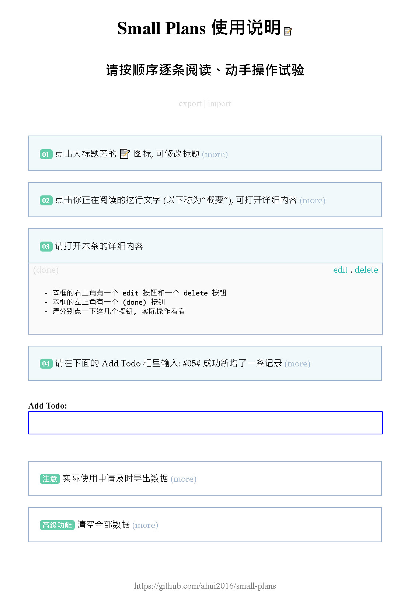

# Small Plans

用于个人小项目的 todo 工具。  
Small Plans for small projects.

## 2019-03-03 重要更新

- 导出/导入功能增加了 "复制当前目录" 功能!
- 由于本软件没有后端, 受限于浏览器无法直接为用户选定目录,  
  为了最大限度地让用户更方便, 现在只要点击一个 copy 按钮即可复制当前目录
- 并且, 导出时 json 文件名也为用户自动设定 (详见使用说明)
- 这些改进都是为了避免用户不小心覆盖文件, 请务必阅读使用说明中关于更改文件名的建议

## 纯天然, 无添加

- 不使用 React, Vue 等任何前端框架
- 不使用 npm, 不使用 Webpack
- 不使用 Bootstrap 等任何 UI 库
- 不使用 JQuery
- 不需要服务器, 整个应用只有一个 HTML 文件
- 原生 HTML, CSS, JavaScript 手工打造, 一共 800 行代码

## 数据安全

- 使用浏览器的 localStorage 临时保全数据, 即使页面意外关闭, 数据也不会丢失
- 提供 export 功能, 可随时导出数据为 json 文件, 永久保存
- 提供 import 功能, 导入 json 文件, 恢复数据
- 建议每次关闭页面前都导出一次, 连同项目代码一起 git push

## 用途

- 适用于个人小项目 (例如一名程序员自己制作的小项目)
- 一般在做个人项目时, 突然想到一个功能可以增加, 或者哪里可以改进, 在这个过程中又会突然发现一个 bug.
此时, 通常无法立即实现全部突然冒出来的想法, 因此就需要先记录下来, 后续逐项完成.

## 为什么不直接用 markdown?

直接使用 markdown 也能完成类似 todolist 的功能, 但使用本软件还是有一些更方便的地方:

- 不用自己写日期, 程序自动帮你记录创建日期、修改日期、完成日期
- 点击一个按钮, 即可在 "未完成" 与 "已完成" 之间转换, 并且自动调整排序位置  
  (如果 markdown 则需要安装不通用的插件或手动复制粘贴)
- 有时候需要添加详细说明, 如果直接使用 markdown, 页面看起来会比较乱.  
  而使用软件可以隐藏详细说明, 保持界面简洁.

## 为什么不使用其他 Todo App?

- 其他 Todo App 是一个单独的应用, 难以与个人项目紧密结合
- 例如, 项目代码 push 到 git 仓库时, 其他 Todo App 的信息无法一起 push
- 而由于 Small Plans 只是一个体积很小的 HTML 文件, 导出的数据也只是一个 JSON 文件, 非常小,  
  因此完全可以放入仓库中, 随时与项目代码一起 push
- 这样做的好处是:
  - 不需要额外编写项目的计划、完成进度, 因为 Small Plans 已包括这些内容, 并且很好地呈现
  - 每次写 commit 描述时不需要想, 只要看一眼 Small Plans 就知道做过什么
  - 另外, 虽然 commit message 也能大概记录软件开发过程, 但毕竟太简短, 会损失很多细节
  - 隔几天或隔一个月回头继续开发时 (个人项目随时中断几天的情况很常见) 也不会茫然, 不用苦苦回想,
    只要看看 Small Plans, 整个开发过程、待办事项、灵感等等都一目了然

## 使用说明

- 下载地址: https://github.com/ahui2016/small-plans/raw/master/releases/small-plans.zip  
  (如需升级新版, 重新下载解压后, 直接用新的 small-plans.html 覆盖旧文件即可)
- 下载并解压缩后, 双击打开 small-plans.html, 点击页面上的 import 按钮, 导入 `使用说明.json` 文件,  
  即可获得互动版使用说明
- 另外, 仓库中还有一个 small-plans.json 文件, 那是本软件开发到一定程度时开始用于记录自身开发过程而产生的文件,
- 建议在实际使用中, 每个项目都拷贝一个 small-plans.html 并更改文件名  
  因为本软件会根据 small-plans.html 所在的文件夹及自身的文件名而显示不同的内容
- **为了避免不小心覆盖不同项目的数据, 强烈建议先改名后再使用**  
  例如把 `small-plans.html` 改为 `xxxx-plans.html` (其中 `xxxx` 是项目名称)

## 截图

## 为什么不采用类似 TiddlyWiki 的方式, 直接导出 html?

- 那种方式, 升级程序太麻烦了
- 现在我的数据与 html 文件是相互独立的, html 文件可随时被覆盖, 当需要升级时,  
  下载新版的 small-plans.html, 直接覆盖旧版的文件即可, 升级非常方便.
