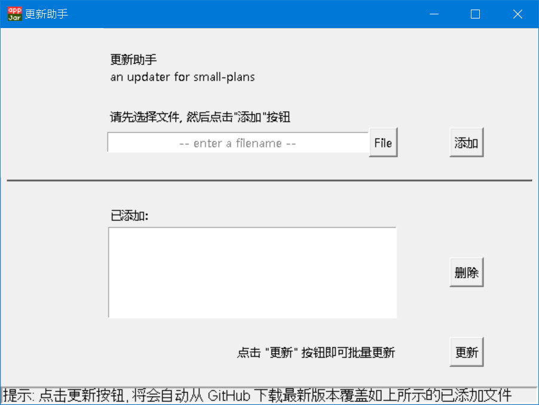

# 更新助手

an updater for small-plans

- 采用 Python 自带的 tkinter 作为 GUI 库,  
  因此, 只要安装 Python 即可运行, 不需要安装任何第三方库.

  
## 用途

- 多个项目同时使用 small-plans.html 时, 需要把 small-plans.html 复制到不同项目的目录下,  
  如果需要更新 small-plans.html, 就比较麻烦 (需要逐一复制粘贴并改名).
- 因此, 特意做了这个更新助手 (updater.pyw), 一键批量更新 small-plans.html

## 下载与安装

- (如果没有安装 Python, 则需要先安装 Python)
- 下载地址: https://github.com/ahui2016/small-plans/raw/master/releases/updater.zip
- 下载解压后, 在控制台执行命令 `python updater.pyw` 即可启动.  
  (如果是 Windows 系统, 双击 updater.pyw 即可)  
  

## 使用方法

- 先选择需要被覆盖更新的文件, 选择后点击 "添加" 按钮添加到列表
- 逐一添加文件后, 点击 "更新" 按钮, 阅读提示框的内容, 再点击 "确定",  
  会自动从 GitHub 下载最新版本的 small-plans.html, 并且自动更新列表中的每一个文件  
- 目标文件列表会自动保存.

## 错误信息

- 如果出现错误 "不是 small-plans 源文件", 那是因为:
  - 为了尽可能确保你的数据安全, 本程序只会覆盖 small-plans 源文件
  - 判断方法是看文件内容的第一行是否包含 `<!--small-plans.html-->`
  - 因此, 只要复制 `<!--small-plans.html-->` 粘贴到目标文件的第一行即可解决该问题
  - 该问题只需要解决一次, 就不会再出现
- 如果出现错误 "远程主机强迫关闭了一个现有的连接", 那是因为:
  - 可能是 GitHub 为了避免滥用而对下载次数作了限制
  - 过一段时间 (或第二天) 重新点击更新应该就可以了
  - 以后会增加一个手动下载的功能
